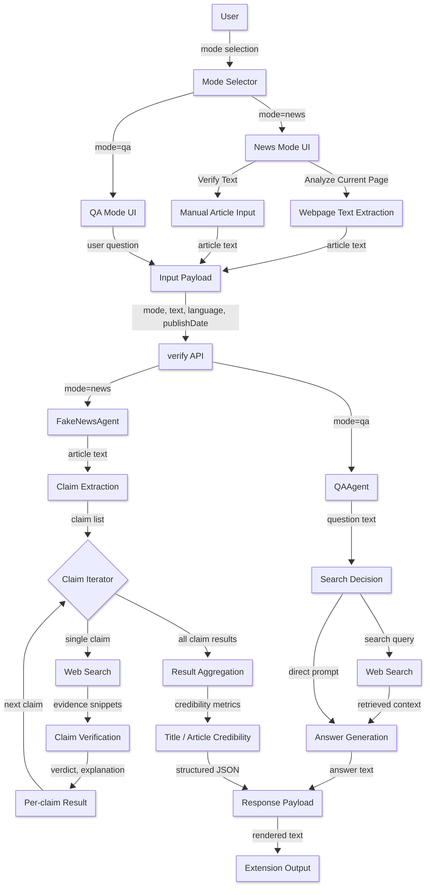

# Fake News Verification System - ToC Final Project

假新聞驗證系統，結合 Chrome Extension、Flask 後端與 LLM API，能夠自動檢測新聞文章和陳述的真實性。

---

## 📋 專案功能

### 核心功能
- ✅ **三種驗證模式**：新聞文章驗證、一般文字驗證、QA 問答
- ✅ **Chrome Extension**：一鍵檢測網頁新聞真假
- ✅ **智能提取**：從新聞中提取標題和關鍵細節
- ✅ **官方來源優先**：優先搜尋政府機構和國際組織，直接採信官方證據
- ✅ **證據立場分析**：判斷證據支持/反駁/無關
- ✅ **時間相關性檢查**：防止「舊聞當新聞」的假新聞手法
- ✅ **多語言支援**：繁體中文、英文、自動偵測

### 驗證模式

#### 模式 A：新聞文章驗證
提取新聞標題和細節 → 搜尋外部證據 → 分析證據立場 → 判斷可信度

#### 模式 B：一般文字驗證
提取可驗證主張 → 搜尋外部證據 → 統計支持/反駁 → 給出可信度

#### 模式 C：QA 問答
自動判斷問題類型 → 條件式網路搜尋 → LLM 生成答案

---

## 🚀 快速架設

### 1. Clone 專案
```bash
git clone https://github.com/Lienlientina/1141_TheoryOfComputation.git
cd "1141_TheoryOfComputation"
```

### 2. 安裝依賴套件
```bash
pip install -r requirements.txt
```

### 3. 設置 API Key
複製 `.env.example` 為 `.env`，填入 API Key：
```bash
copy .env.example .env
```

編輯 `.env`：
```env
API_BASE_URL=https://api-gateway.netdb.csie.ncku.edu.tw
API_KEY=你的API金鑰
```

### 4. 啟動後端
```bash
python fake_news_server.py
```

看到 `Running on http://127.0.0.1:5000` 表示成功。

### 5. 安裝 Chrome Extension
1. 開啟 Chrome，進入 `chrome://extensions/`
2. 開啟「開發人員模式」
3. 點擊「載入未封裝項目」
4. 選擇 `extension` 資料夾

### 6. 開始使用
- 瀏覽新聞網站 → 點擊 Extension 圖標 → 選擇模式 → 開始驗證

---

## 📁 專案架構

```
.
├── extension/                # Chrome Extension
│   ├── manifest.json        # Extension 配置
│   ├── popup.html           # UI 介面
│   ├── popup.js             # UI 邏輯
│   └── content.js           # 網頁內容提取
│
├── fake_news_server.py      # Flask 後端 (多模式路由)
├── fake_news_agent.py       # 新聞驗證 Agent
├── qa_agent.py              # QA 問答 Agent
│
├── llm_helpers.py           # LLM API 統一介面
├── extractors.py            # Title/Details/Claims 提取
├── evidence_processor.py    # 證據搜尋、過濾、分析 (544行)
│   ├── 官方來源優先搜尋
│   ├── 預過濾機制
│   └── 證據立場判斷
│
├── temporal_checker.py      # 時間相關性檢查 (360行)
│   ├── LLM-based 時間標準化
│   ├── 時間範圍計算
│   └── 相關性判斷
│
├── qa_tool.py               # 網路搜尋工具
├── .env.example             # API 配置範本
├── requirements.txt         # Python 依賴
└── README.md                # 本文件
```

### 核心模組說明

**fake_news_agent.py**
- 自動模式偵測（新聞 vs 一般文字）
- 三層驗證流程協調
- 結果彙總與判斷

**evidence_processor.py**
- 兩階段搜尋：官方來源優先 → 一般搜尋
- 支援各國政府域名 (.gov.tw, .go.jp 等)
- 國際組織 (UN, WHO, IMF 等)
- 時間相關性整合檢查

**temporal_checker.py**
- 多語言時間表達式解析
- 跨月份日期計算
- 防止「舊聞當新聞」

**qa_agent.py**
- 自動判斷是否需要搜尋
- 對話歷史管理
- 來源引用功能

---

## 🏗️ 系統流程圖 (DAG)


### 整體架構
```
Chrome Extension
    ↓ HTTP POST {mode, text, language}
Flask Server (:5000)
    ↓
    ├─→ mode="news" → FakeNewsAgent
    └─→ mode="qa" → QAAgent
        ↓
    evidence_processor + temporal_checker
        ↓
    LLM API (gpt-oss:20b)
        ↓
    DuckDuckGo Search
```

### 新聞驗證流程（mode=news）
```
1. 提取層
   網頁內容 → extract_title_and_details() → Title + Details

2. 驗證層 (每個 Detail)
   ├─ [階段1] 官方來源搜尋 (site: filter)
   │   └─ 找到 → 直接採信 (authoritative_override)
   ├─ [階段2] 一般搜尋
   │   ├─ Web Search (10筆)
   │   ├─ 預過濾不相關
   │   ├─ 時間相關性檢查
   │   └─ 證據立場分析 (support/refute/irrelevant)
   └─ 返回 Detail 驗證結果

3. 判斷層
   所有 Detail 結果 → judge_title() → CREDIBLE/MISLEADING/UNCERTAIN
```

---

## 🔧 系統需求

- **Python**: 3.8+
- **瀏覽器**: Google Chrome 或 Chromium-based
- **網路**: 需連接外網搜尋
- **LLM API Key**: 由課程提供

---

## 📝 更新日誌

### Version 3.0 (2026-01-02)
- ✨ 整合 QA Agent 與 新聞驗證 Agent

### Version 2.2 (2026-01-02)
- ✨ 整合 QA Agent (多模式架構)
- ✨ 官方來源優先搜尋
- ✨ 時間相關性檢查增強

### Version 2.1 (2026-01-01)
- ✨ 時間相關性檢查模組
- ✨ 防止「舊聞當新聞」

### Version 2.0 (2025-12-30)
- ✨ Chrome Extension
- ✨ 三層驗證架構
- ✨ 模組化重構

### Version 1.0 (2025-12)
- ✨ 基礎 QA Agent 功能
- ✨ 網路搜尋

---
